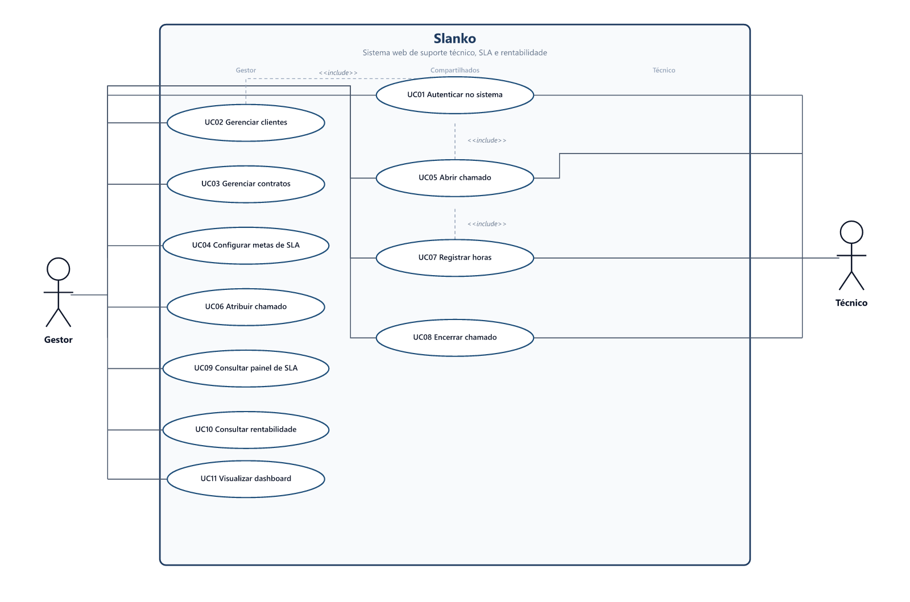
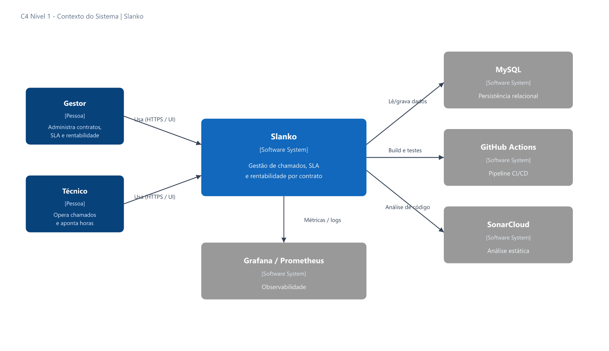
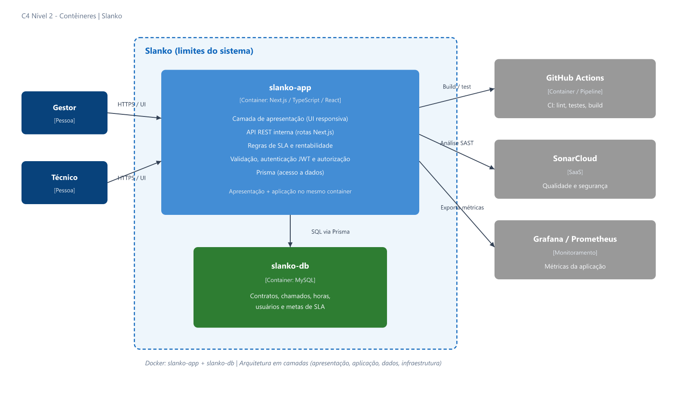

# Slanko

**Nome do Estudante:** Miguel Ricardo Buttendorf  
**Curso:** Engenharia de Software  
**Instituição:** Centro Universitário Católica de Santa Catarina  
**Linha de projeto:** Web Apps  

Sistema web para gestão de contratos de suporte técnico com análise de SLA e rentabilidade.

---

## Navegação

* [Descrição](#descrição)
* [Trabalhos relacionados](#trabalhos-relacionados)
* [Documentação](#documentação)
* [Especificação técnica](#especificação-técnica)
* [Arquitetura](#arquitetura)
* [Diagramas](#diagramas)
* [Modelagem de dados](#modelagem-de-dados)
* [Status de implementação](#status-de-implementação)
* [Instruções de execução](#instruções-de-execução)
* [Próximos passos](#próximos-passos)
* [Referências](#referências)

---

## Descrição

O **Slanko** é um sistema web voltado a microempresas de TI que prestam suporte técnico. A plataforma centraliza chamados, contratos, apontamento de horas, acompanhamento de SLA e indicadores de rentabilidade.

O nome remete a SLA de forma memorável. No repositório e no código, o projeto é referenciado como `slanko`.

### Contexto

Muitas microempresas acompanham chamados e prazos em planilhas ou ferramentas isoladas. Fica difícil cruzar o esforço real (horas) com o valor contratado e identificar contratos deficitários.

### Justificativa

Ferramentas de helpdesk cobrem tickets e SLA, mas raramente consolidam custo por hora e margem por contrato de forma simples para microempresas. O Slanko une operação e indicadores de rentabilidade, sem se tornar ERP ou sistema financeiro genérico.

### Objetivos

Entregar uma aplicação web funcional com três fluxos de negócio completos:

1. **Gestão de chamados** (clientes, contratos, abertura, atribuição, horas e encerramento)
2. **Monitoramento de SLA** (metas por contrato, cumprimento, violações e painel)
3. **Análise de rentabilidade** (horas × custo/hora versus valor do contrato, margem e alertas)

### Motivação

Projeto acadêmico da linha Web Apps (PAC VII / Portfólio), com arquitetura cliente-servidor em camadas, testes, CI/CD e documentação técnica.

---

## Trabalhos relacionados

Baseados no relatório do PAC 7B:

* Rachmawati e Suhendra (2018): helpdesk web com tickets
* Clarin (2023): priorização/escalonamento de atendimentos
* Jain, Gupta e Neha (2024): otimização de filas de suporte com IA (foco operacional)
* Zendesk e Jira Service Management: SLA e operação maduros
* Freshservice: contratos, sem consolidar nativamente custo/hora e margem por contrato

A lacuna comum é a baixa integração entre operação e rentabilidade por horas trabalhadas. Detalhes e referências completas: [docs/RFC.md](docs/RFC.md).

---

## Documentação

### Documentos do projeto

| Documento | Conteúdo |
|---|---|
| [docs/RFC.md](docs/RFC.md) | Escopo, RF/RNF, critérios de aceite, stack e decisões |
| [docs/casos-de-uso.md](docs/casos-de-uso.md) | Atores, UC01–UC11 e rastreabilidade |
| [docs/arquitetura-c4.md](docs/arquitetura-c4.md) | C4 (contexto, contêineres e componentes) |
| [docs/modelagem.md](docs/modelagem.md) | DER, dicionário de dados, regras e esboço Prisma |

A documentação oficial permanece no repositório e, depois, na Wiki do GitHub (não em Notion/Obsidian para entrega).

### Estrutura atual do repositório

```text
slanko/
├── src/
│   ├── app/                    # Next.js pages and API routes
│   ├── components/             # UI (dashboard in later iterations)
│   ├── lib/                    # prisma client, http helpers, errors
│   ├── repositories/           # data access (Prisma)
│   ├── services/               # business rules
│   └── types/                  # shared DTOs
├── tests/                      # Vitest unit and API route tests
├── prisma/                     # schema, migrations, seed
├── docker-compose.yml          # MySQL local (slanko-db)
├── package.json
└── vitest.config.ts
```

### Versionamento

Commits em inglês, no padrão Conventional Commits:

* `feat:` new feature
* `fix:` bug fix
* `docs:` documentation only
* `test:` tests
* `chore:` tooling, config, or maintenance
* `refactor:` code change without new feature or fix

Exemplos:

* `docs: add RFC, use cases, C4 and data model`
* `feat: add contract registration API`
* `fix: correct SLA response time calculation`

---

## Especificação técnica

### Requisitos funcionais (resumo)

```text
RF01: Autenticação JWT e perfis (gestor e técnico)
RF02: Cadastro de clientes
RF03: Cadastro de contratos vinculados a clientes
RF04: Abertura de chamados com prioridade e categoria
RF05: Atribuição de chamado a técnico
RF06: Apontamento de horas (gestor ou técnico)
RF07: Encerramento de chamado com solução e histórico
RF08: Metas de SLA por contrato
RF09: Cálculo de cumprimento de SLA
RF10: Painel e sinalização de violações de SLA
RF11: Cálculo de custo operacional (horas × custo/hora)
RF12: Indicadores de margem/rentabilidade por contrato
RF13: Alertas para contratos deficitários ou com SLA crítico
RF14: Dashboard consolidado
```

### Requisitos não funcionais (resumo)

```text
RNF01: Interface responsiva com feedback ao usuário
RNF02: Arquitetura cliente-servidor em camadas
RNF03: Persistência MySQL (sem SQLite/H2)
RNF04: TDD com cobertura mínima 75% backend / 25% frontend
RNF05: CI/CD com GitHub Actions
RNF06: Análise estática (SonarCloud)
RNF07: Observabilidade (Grafana e/ou Prometheus)
RNF08: Segurança (validação, XSS/CSRF, senhas criptografadas)
RNF09: Código modular sob o identificador slanko
RNF10: Documentação no repositório/Wiki
```

Detalhamento e critérios de aceite: [docs/RFC.md](docs/RFC.md).

### Stack tecnológica

| Camada | Tecnologia |
|---|---|
| Full-stack | TypeScript, Next.js, React |
| Dados | MySQL, Prisma |
| Testes | Jest e/ou Vitest (TDD) |
| Infra | Docker (`slanko-app`, `slanko-db`) |
| CI/CD | GitHub Actions |
| Qualidade | SonarCloud |
| Observabilidade | Grafana e/ou Prometheus |

### Segurança

* Autenticação JWT e autorização por perfil (gestor / técnico)
* Criptografia de senhas
* Validação de entradas e proteção contra XSS/CSRF
* Segredos apenas em variáveis de ambiente

---

## Arquitetura

Arquitetura adotada: **cliente-servidor em camadas**.

```text
Apresentação     → Next.js / React / TypeScript
Aplicação        → rotas/API, validação, regras de SLA e rentabilidade
Dados            → Prisma + repositories
Persistência     → MySQL (slanko-db)
Infraestrutura   → Docker, GitHub Actions, SonarCloud, monitoramento
```

Organização de código prevista:

* `components/` interface
* `services/` regras de negócio
* `repositories/` acesso a dados
* `tests/` testes automatizados

Documentação completa: [docs/arquitetura-c4.md](docs/arquitetura-c4.md).

### Metodologia

Desenvolvimento iterativo com Kanban, commits frequentes e entregas modulares. Gestão de tarefas: GitHub Projects (ou equivalente do playbook).

### Registro de decisões

* [RFC: Proposta Slanko](docs/RFC.md)

---

## Diagramas

### Casos de uso



Atores: **Gestor** e **Técnico** (UC01 a UC11).  
Detalhamento: [docs/casos-de-uso.md](docs/casos-de-uso.md).

### C4 - Contexto (nível 1)



### C4 - Contêineres (nível 2)



Detalhamento: [docs/arquitetura-c4.md](docs/arquitetura-c4.md).

### Fluxo de negócio (resumo)

1. Gestor cadastra clientes e contratos (valor e metas de SLA)
2. Técnico/gestor registra chamados e aponta horas
3. O sistema calcula cumprimento de SLA e violações
4. O sistema calcula custo operacional e margem por contrato
5. Dashboard exibe indicadores e alertas

---

## Modelagem de dados


Entidades: **User**, **Client**, **Contract**, **Ticket**, **TimeEntry**.

* SLA: metas no contrato (`response_minutes`, `resolution_minutes`)
* Rentabilidade: `TimeEntry.hours × User.hourly_cost` comparado a `Contract.value`

Dicionário de dados, regras e esboço Prisma: [docs/modelagem.md](docs/modelagem.md).

---

## Status de implementação

| Área | Status |
|---|---|
| Documentação (RFC, UC, C4, modelagem) | Concluída (fase de planejamento) |
| Banco MySQL + Prisma + Docker | Concluído (schema, migrate, seed) |
| Back-end (Next.js API + services) | Em andamento (scaffold base) |
| Front-end (UI / dashboard) | Pendente |
| Testes (TDD 75% / 25%) | Em andamento (Vitest + testes iniciais) |
| CI/CD (GitHub Actions) | Em andamento (CI v1: lint, test, build) |
| SonarCloud | Pendente |
| Observabilidade | Pendente |
| Wiki do GitHub | Pendente |

---

## Instruções de execução

### Pré-requisitos

* Node.js 18+ (LTS recomendado)
* [Docker Desktop](https://www.docker.com/products/docker-desktop/) (Windows)
* Git

### Setup local (banco de dados)

1. Clone o repositório e entre na pasta do projeto.
2. Copie o arquivo de ambiente:
   ```bash
   cp .env.example .env
   ```
   No Windows (PowerShell): `Copy-Item .env.example .env`
3. Instale as dependências:
   ```bash
   npm install
   ```
4. Suba o MySQL no Docker:
   ```bash
   npm run db:up
   ```
   Aguarde o container `slanko-db` ficar saudável (`docker ps`).
5. Crie as tabelas no banco:
   ```bash
   npm run db:migrate
   ```
   Na primeira execução, confirme o nome da migração (ex.: `init`).
6. (Opcional) Popule dados de exemplo:
   ```bash
   npm run db:seed
   ```
7. (Opcional) Abra uma interface visual do banco:
   ```bash
   npm run db:studio
   ```

**Usuários de teste (seed):** `gestor@slanko.local` e `tecnico@slanko.local` — senha `Slanko@123`.

**Scripts úteis:** `npm run db:down` (para o MySQL), `npm run db:logs` (logs do container), `npm run db:reset` (apaga e recria tudo — cuidado).

### Aplicação (Next.js)

```bash
npm run dev
```

Abra [http://localhost:3000](http://localhost:3000). Endpoints iniciais:

* `GET /api/health` — status da app e do MySQL
* `GET /api/users` — usuários ativos (sem senha)
* `GET /api/clients` — clientes ativos

### Testes

```bash
npm test
npm run test:watch
```

### CI (GitHub Actions)

O workflow `.github/workflows/ci.yml` roda em todo push/PR para `main`:

1. `npm ci`
2. `npx prisma validate`
3. `npm run lint`
4. `npm test`
5. `npm run build`

Próximas evoluções previstas: MySQL service para testes de integração, cobertura mínima e SonarCloud.

Próximo passo: autenticação JWT e módulos de contratos/chamados.

---

## Resultados esperados

Ao final do Portfólio:

* aplicação navegável com os três fluxos de negócio
* cobertura de testes conforme a linha Web Apps
* CI/CD e análise estática
* documentação técnica completa (incluindo Wiki e guia de execução)

---

## Conclusão

O Slanko formaliza um webapp para gestão integrada de contratos de suporte técnico. O diferencial é correlacionar chamados, SLA e custo real das horas para indicar a rentabilidade por contrato, em formato adequado a microempresas de TI.

---

## Próximos passos

* [x] Estruturar repositório GitHub e README
* [x] Publicar RFC (`docs/RFC.md`)
* [x] Documentar casos de uso
* [x] Documentar arquitetura C4
* [x] Elaborar modelagem de dados
* [x] Configurar banco (Docker MySQL + Prisma + migrate + seed)
* [x] Scaffold Next.js (API base + camadas services/repositories)
* [ ] CI/CD (GitHub Actions) — v1 em `feat/ci-pipeline`
* [ ] Implementar autenticação e contratos
* [ ] Implementar chamados, SLA e rentabilidade
* [ ] Testes, CI/CD, SonarCloud e monitoramento
* [ ] Wiki do GitHub

---

## Referências

### Trabalhos acadêmicos e mercado

* RACHMAWATI, E.; SUHENDRA (2018). Web-Based Ticketing System Helpdesk Application Using CodeIgniter Framework.
* CLARIN, J. A. (2023). Priority-Based Scheduling Algorithm for Help Desk Support System.
* JAIN, S.; GUPTA, A.; NEHA, K. (2024). AI Enhanced Ticket Management System for Optimized Support.
* Zendesk (políticas de SLA)
* Freshservice (Contract Management Setup Guide)
* Atlassian / Jira Service Management (SLAs)

Referências completas: [docs/RFC.md](docs/RFC.md).

### Documentos do projeto e da disciplina

* [docs/RFC.md](docs/RFC.md)
* [docs/casos-de-uso.md](docs/casos-de-uso.md)
* [docs/arquitetura-c4.md](docs/arquitetura-c4.md)
* [docs/modelagem.md](docs/modelagem.md)
* [Portfolio Directions Geral](https://github.com/CatolicaSC-Portfolio/The-Portfolio-Playbook/blob/main/directions/portfolio-directions-GERAL.md)
* [Portfolio Directions Web Apps](https://github.com/CatolicaSC-Portfolio/The-Portfolio-Playbook/blob/main/directions/portfolio-directions-webapp.md)
* [Disciplina de Portfólio](https://github.com/CatolicaSC-Portfolio/The-Portfolio-Playbook/blob/main/Portfolio.md)
* Relatório Final PAC 7B (proposta Slanko)

---

## Autor

**Miguel Ricardo Buttendorf**  
Projeto acadêmico - Engenharia de Software - Católica SC.

## Licença

Uso acadêmico e de portfólio. Licença definitiva a definir no repositório.
