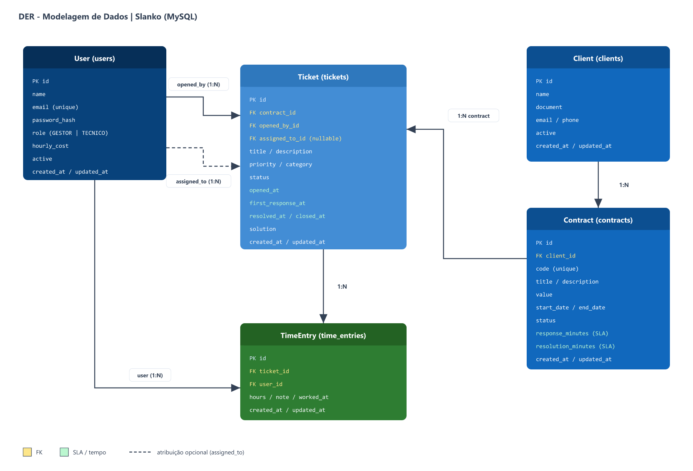

# Modelagem de Dados - Slanko

Modelo relacional do banco MySQL do Slanko, alinhado ao [RFC](RFC.md), aos [casos de uso](casos-de-uso.md) e à arquitetura em camadas documentada no [C4](arquitetura-c4.md).

## Decisões de modelagem

* Banco: **MySQL** (persistência relacional real).
* Acesso: **Prisma** (ORM) na camada de dados.
* Metas de SLA ficam no **contrato** (`response_minutes`, `resolution_minutes`) no MVP. Se no futuro for necessário histórico de alteração de metas, extrai-se uma tabela `SlaRule`.
* Horas trabalhadas ficam em `TimeEntry`, vinculadas ao chamado e ao usuário que apontou (gestor ou técnico).
* Nomes de tabelas no banco em `snake_case` (padrão Prisma/MySQL); no código TypeScript usam-se modelos em `PascalCase`.

## Diagrama entidade-relacionamento (DER)



## Visão geral das entidades

| Entidade | Tabela | Responsabilidade |
|---|---|---|
| User | `users` | Usuários do sistema (gestor e técnico), com custo/hora |
| Client | `clients` | Clientes da microempresa |
| Contract | `contracts` | Contratos com valor, vigência e metas de SLA |
| Ticket | `tickets` | Chamados de suporte |
| TimeEntry | `time_entries` | Apontamento de horas por chamado |

## Relacionamentos e cardinalidades

| Relacionamento | Cardinalidade | Descrição |
|---|---|---|
| Client → Contract | 1:N | Um cliente possui vários contratos |
| Contract → Ticket | 1:N | Um contrato possui vários chamados |
| User → Ticket (abertura) | 1:N | Um usuário abre vários chamados |
| User → Ticket (atribuição) | 1:N | Um técnico/gestor pode ser responsável por vários chamados |
| Ticket → TimeEntry | 1:N | Um chamado recebe vários apontamentos |
| User → TimeEntry | 1:N | Um usuário registra vários apontamentos |

```text
User 1 ──< Ticket (opened_by)
User 1 ──< Ticket (assigned_to)   [opcional até a atribuição]
Client 1 ──< Contract 1 ──< Ticket 1 ──< TimeEntry
User 1 ──< TimeEntry
```

## Dicionário de dados

### `users`

| Campo | Tipo | Nulo | Descrição |
|---|---|---|---|
| id | CHAR(36) / UUID | não | Identificador |
| name | VARCHAR(120) | não | Nome |
| email | VARCHAR(180) | não | E-mail (único) |
| password_hash | VARCHAR(255) | não | Hash da senha |
| role | ENUM(`GESTOR`,`TECNICO`) | não | Perfil de acesso |
| hourly_cost | DECIMAL(10,2) | não | Custo/hora do colaborador (base da rentabilidade) |
| active | BOOLEAN | não | Usuário ativo |
| created_at | DATETIME | não | Criação |
| updated_at | DATETIME | não | Atualização |

Índices: único em `email`.

### `clients`

| Campo | Tipo | Nulo | Descrição |
|---|---|---|---|
| id | CHAR(36) / UUID | não | Identificador |
| name | VARCHAR(180) | não | Razão social / nome |
| document | VARCHAR(32) | sim | CNPJ/CPF (opcional no MVP) |
| email | VARCHAR(180) | sim | Contato |
| phone | VARCHAR(40) | sim | Telefone |
| active | BOOLEAN | não | Cliente ativo |
| created_at | DATETIME | não | Criação |
| updated_at | DATETIME | não | Atualização |

### `contracts`

| Campo | Tipo | Nulo | Descrição |
|---|---|---|---|
| id | CHAR(36) / UUID | não | Identificador |
| client_id | CHAR(36) | não | FK → `clients.id` |
| code | VARCHAR(40) | não | Código interno do contrato (único) |
| title | VARCHAR(180) | não | Título |
| description | TEXT | sim | Escopo resumido |
| value | DECIMAL(12,2) | não | Valor contratado (receita de referência) |
| start_date | DATE | não | Início da vigência |
| end_date | DATE | sim | Fim da vigência |
| status | ENUM(`DRAFT`,`ACTIVE`,`SUSPENDED`,`FINISHED`) | não | Situação |
| response_minutes | INT | não | Meta de SLA: tempo de 1ª resposta (minutos) |
| resolution_minutes | INT | não | Meta de SLA: tempo de resolução (minutos) |
| created_at | DATETIME | não | Criação |
| updated_at | DATETIME | não | Atualização |

Índices: único em `code`; índice em `client_id`, `status`.

### `tickets`

| Campo | Tipo | Nulo | Descrição |
|---|---|---|---|
| id | CHAR(36) / UUID | não | Identificador |
| contract_id | CHAR(36) | não | FK → `contracts.id` |
| opened_by_id | CHAR(36) | não | FK → `users.id` (quem abriu) |
| assigned_to_id | CHAR(36) | sim | FK → `users.id` (responsável) |
| title | VARCHAR(180) | não | Título do chamado |
| description | TEXT | não | Detalhamento |
| priority | ENUM(`LOW`,`MEDIUM`,`HIGH`,`CRITICAL`) | não | Prioridade |
| category | VARCHAR(80) | não | Categoria (ex.: rede, software, hardware) |
| status | ENUM(`OPEN`,`IN_PROGRESS`,`WAITING`,`RESOLVED`,`CLOSED`) | não | Status |
| opened_at | DATETIME | não | Abertura (início do SLA) |
| first_response_at | DATETIME | sim | Momento da 1ª resposta (SLA de resposta) |
| resolved_at | DATETIME | sim | Momento da resolução (SLA de resolução) |
| closed_at | DATETIME | sim | Encerramento |
| solution | TEXT | sim | Registro da solução |
| created_at | DATETIME | não | Criação |
| updated_at | DATETIME | não | Atualização |

Índices: `contract_id`, `status`, `assigned_to_id`, `opened_at`.

### `time_entries`

| Campo | Tipo | Nulo | Descrição |
|---|---|---|---|
| id | CHAR(36) / UUID | não | Identificador |
| ticket_id | CHAR(36) | não | FK → `tickets.id` |
| user_id | CHAR(36) | não | FK → `users.id` (quem apontou) |
| hours | DECIMAL(6,2) | não | Horas trabalhadas (> 0) |
| note | VARCHAR(255) | sim | Observação do apontamento |
| worked_at | DATETIME | não | Data/hora do trabalho |
| created_at | DATETIME | não | Criação |
| updated_at | DATETIME | não | Atualização |

Índices: `ticket_id`, `user_id`, `worked_at`.

## Regras de negócio derivadas do modelo

### SLA
* Meta de resposta e resolução vêm do `contracts.response_minutes` e `contracts.resolution_minutes`.
* Cumprimento de resposta: diferença entre `tickets.first_response_at` e `tickets.opened_at`.
* Cumprimento de resolução: diferença entre `tickets.resolved_at` e `tickets.opened_at`.
* Violação: tempo decorrido maior que a meta do contrato.

### Rentabilidade
* Custo de um apontamento: `time_entries.hours * users.hourly_cost`.
* Custo operacional do contrato: soma dos custos dos apontamentos dos chamados daquele contrato.
* Margem aproximada: `contracts.value - custo_operacional`.
* Contrato deficitário: margem negativa (alerta no dashboard).

### Autorização (alto nível)
* `GESTOR`: clientes, contratos, SLA, atribuição, indicadores e operação de chamados/horas.
* `TECNICO`: abertura/atualização de chamados, apontamento de horas e encerramento.

## Rastreabilidade

| Entidade | Casos de uso | Requisitos |
|---|---|---|
| User | UC01 | RF01 |
| Client | UC02 | RF02 |
| Contract | UC03, UC04 | RF03, RF08 |
| Ticket | UC05, UC06, UC08, UC09 | RF04, RF05, RF07, RF09, RF10 |
| TimeEntry | UC07, UC10 | RF06, RF11, RF12 |

## Esboço Prisma (referência futura)

```prisma
enum Role {
  GESTOR
  TECNICO
}

enum ContractStatus {
  DRAFT
  ACTIVE
  SUSPENDED
  FINISHED
}

enum TicketPriority {
  LOW
  MEDIUM
  HIGH
  CRITICAL
}

enum TicketStatus {
  OPEN
  IN_PROGRESS
  WAITING
  RESOLVED
  CLOSED
}

model User {
  id           String   @id @default(uuid())
  name         String
  email        String   @unique
  passwordHash String   @map("password_hash")
  role         Role
  hourlyCost   Decimal  @map("hourly_cost") @db.Decimal(10, 2)
  active       Boolean  @default(true)
  createdAt    DateTime @default(now()) @map("created_at")
  updatedAt    DateTime @updatedAt @map("updated_at")

  openedTickets   Ticket[]    @relation("TicketOpenedBy")
  assignedTickets Ticket[]    @relation("TicketAssignedTo")
  timeEntries     TimeEntry[]

  @@map("users")
}

model Client {
  id        String     @id @default(uuid())
  name      String
  document  String?
  email     String?
  phone     String?
  active    Boolean    @default(true)
  createdAt DateTime   @default(now()) @map("created_at")
  updatedAt DateTime   @updatedAt @map("updated_at")
  contracts Contract[]

  @@map("clients")
}

model Contract {
  id                String         @id @default(uuid())
  clientId          String         @map("client_id")
  code              String         @unique
  title             String
  description       String?        @db.Text
  value             Decimal        @db.Decimal(12, 2)
  startDate         DateTime       @map("start_date") @db.Date
  endDate           DateTime?      @map("end_date") @db.Date
  status            ContractStatus @default(DRAFT)
  responseMinutes   Int            @map("response_minutes")
  resolutionMinutes Int            @map("resolution_minutes")
  createdAt         DateTime       @default(now()) @map("created_at")
  updatedAt         DateTime       @updatedAt @map("updated_at")

  client  Client   @relation(fields: [clientId], references: [id])
  tickets Ticket[]

  @@map("contracts")
}

model Ticket {
  id             String         @id @default(uuid())
  contractId     String         @map("contract_id")
  openedById     String         @map("opened_by_id")
  assignedToId   String?        @map("assigned_to_id")
  title          String
  description    String         @db.Text
  priority       TicketPriority
  category       String
  status         TicketStatus   @default(OPEN)
  openedAt       DateTime       @map("opened_at")
  firstResponseAt DateTime?     @map("first_response_at")
  resolvedAt     DateTime?      @map("resolved_at")
  closedAt       DateTime?      @map("closed_at")
  solution       String?        @db.Text
  createdAt      DateTime       @default(now()) @map("created_at")
  updatedAt      DateTime       @updatedAt @map("updated_at")

  contract    Contract    @relation(fields: [contractId], references: [id])
  openedBy    User        @relation("TicketOpenedBy", fields: [openedById], references: [id])
  assignedTo  User?       @relation("TicketAssignedTo", fields: [assignedToId], references: [id])
  timeEntries TimeEntry[]

  @@map("tickets")
}

model TimeEntry {
  id        String   @id @default(uuid())
  ticketId  String   @map("ticket_id")
  userId    String   @map("user_id")
  hours     Decimal  @db.Decimal(6, 2)
  note      String?
  workedAt  DateTime @map("worked_at")
  createdAt DateTime @default(now()) @map("created_at")
  updatedAt DateTime @updatedAt @map("updated_at")

  ticket Ticket @relation(fields: [ticketId], references: [id])
  user   User   @relation(fields: [userId], references: [id])

  @@map("time_entries")
}
```

Este bloco foi materializado em `prisma/schema.prisma` na branch de setup do banco.

## Próximos passos técnicos

1. Scaffold Next.js consumindo o Prisma Client.
2. Implementar autenticação e APIs de negócio.
3. Evoluir seeds e testes de integração.
